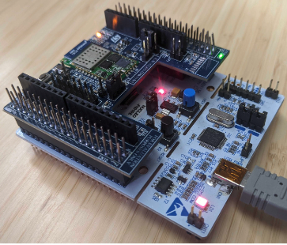

This is the code of the application flashed on the STM32-NucleoF401RE board (expanded with an
X-NUCLEO-IDW01M1 Wi-Fi Module). 

The application has been compiled using [this online IDE](https://ide.mbed.com/compiler) which automatically selects the compilation toolchain (and therefore, all the linked libraries) to eventually generate the monolithic firmware image.

To reproduce:

1. Modify the source code of the firmware (fw-code/main.cpp) to connect to your router (THERE IS NO SUPPORT FOR 5G AFAIK) and compile.
2. Connect a machine to the same router and run the exploit_poc.py script ( this is going to send command to the IoT device once it connects).
3. Flash the firmware on the hardware device (STM32-NucleoF401RE board expanded with an X-NUCLEO-IDW01M1 Wi-Fi Module) using [st-link](https://github.com/stlink-org/stlink)
4. Wait for the IoT device to connect to the machine and observe exploit.
5. If you want to see the log of the attacks you also need to connect the STM board to a machine via USB. You can easily do it with [Mbed Studio](https://os.mbed.com/studio/)
